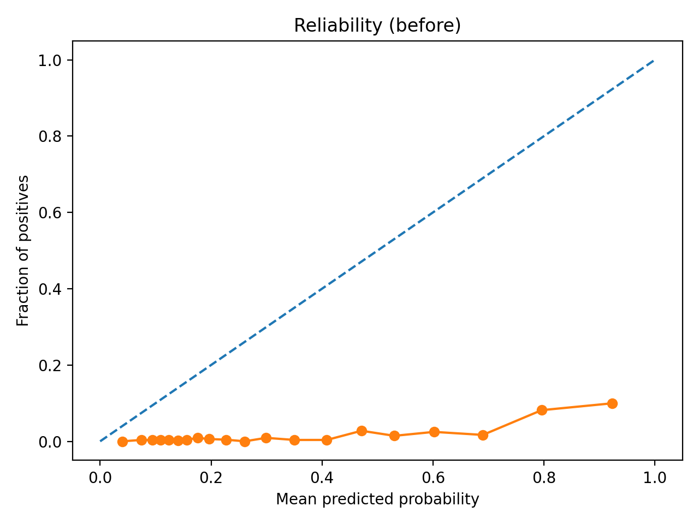
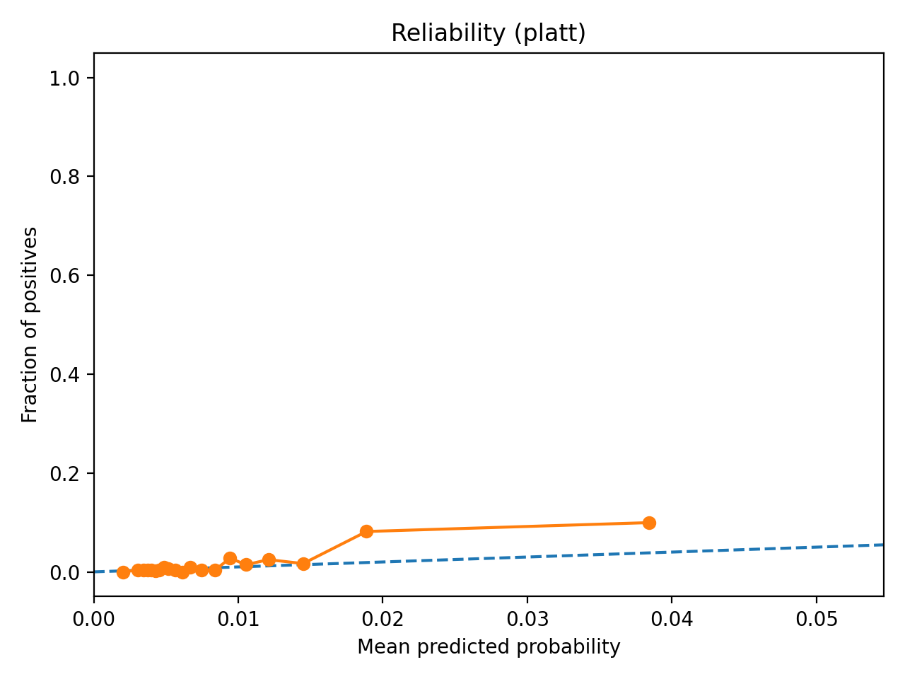
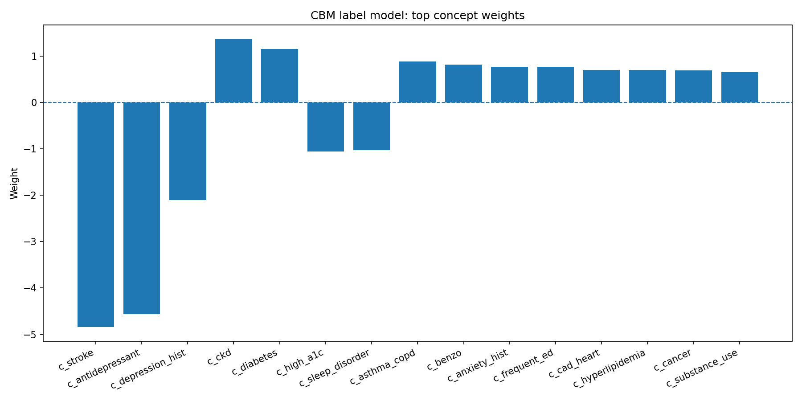

# TrustMed-Pilot — Calibrated Clinical Risk Prediction (Synthetic EHR)

A small, reproducible pilot project for **clinical risk prediction on synthetic EHR** with a focus on **trust & safety**:

- **Calibration** (are predicted probabilities meaningful?)
- **Selective prediction / deferral** (when the model is uncertain, can we “defer” instead of guessing?)
- **Concept-Bottleneck explanations (CBM)** (ground decisions in interpretable clinical concepts)
- *(Optional)* **privacy/memorization risk** via a lightweight membership-inference baseline

> ⚠️ **Not for clinical use.** This repo uses **synthetic** EHR data (e.g., Synthea-style CSVs). Outputs are for research / education only.

---

## What this project does

Imagine the model is a “risk thermometer”:

- It looks at a patient’s recent history and concept indicators (e.g., diabetes / CKD / high A1c).
- It outputs a number like **0.02** = “about 2% chance” of the target event in the future window.

This repo checks two things:

1) **Is the ranking good?**  
   Higher-risk patients should get higher scores. I measure this with **AUROC / AUPRC**.

2) **Is the probability honest?**  
   If the model says “2% risk” for a group of people, then about **2%** of them should actually have the event.  
   This is what **calibration** and the **reliability diagrams** show.

For explainability:

- I also train a **Concept Bottleneck Model (CBM)**:
  - Each patient is represented by interpretable concepts (the `c_*` columns like `c_diabetes`, `c_ckd`, `c_high_a1c`, etc.).
  - A simple label model combines concepts into a risk score.
  - The learned concept weights show **which concepts push risk up/down**.

---

## Repository structure

```
src/
  build_dataset.py            # build a basic dataset from raw synthetic EHR CSVs
  augment_concepts.py         # add interpretable concept columns (c_*)
  label_mh_future.py          # optional: define the prediction target using future-horizon labeling
  train_baseline.py           # train baseline risk model + write predictions
  calibrate_compare.py        # compare calibration methods + save reliability plots
  train_cbm.py                # train concept-bottleneck model + concept weight plot
  eval_calib_deferral_mia.py  # optional: deferral + simple membership-inference baseline

artifacts/
  calibration_summary.txt
  cbm_summary.txt
  cbm_concept_weights.png
  reliability_before.png
  reliability_platt.png
```

---

## Quickstart (run end-to-end)

### 0) Setup environment

```bash
python -m venv .venv

# Windows
.\.venv\Scripts\activate

# macOS/Linux
# source .venv/bin/activate

pip install -U pip
pip install numpy pandas scikit-learn matplotlib joblib
```

### 1) Prepare data

You need a processed dataset CSV at:

- `data/processed/dataset_mh_v2.csv`

It should contain:

- `y` (binary label)
- identifiers like `PATIENT`
- features (utilization features + concept columns `c_*`)

If you start from raw synthetic EHR (Synthea-style CSVs), you can generate it:

```bash
# (A) Build a base timeline dataset from raw csv_dir (patients/encounters tables)
python .\src\build_dataset.py --csv_dir <PATH_TO_SYNTHEA_CSV_DIR> --out .\data\processed\dataset.csv

# (B) Add interpretable concept columns (conditions/medications/observations)
python .\src\augment_concepts.py --csv_dir <PATH_TO_SYNTHEA_CSV_DIR> --in_dataset .\data\processed\dataset.csv --out_dataset .\data\processed\dataset_v2.csv

# (C) (Optional) Relabel target using future-horizon events
python .\src\label_mh_future.py --csv_dir <PATH_TO_SYNTHEA_CSV_DIR> --in_dataset .\data\processed\dataset_v2.csv --out_dataset .\data\processed\dataset_mh_v2.csv --horizon_days 365 --target both
```

### 2) Splits

Training uses a precomputed patient-level split file:

- `artifacts/splits.csv`

It maps rows to `train/val/test` and helps prevent patient leakage across splits.

### 3) Train baseline risk model (and write predictions)

```bash
python .\src\train_baseline.py --data .\data\processed\dataset_mh_v2.csv --splits .\artifacts\splits.csv --out_dir .\artifacts
```

Outputs (may include):

- `artifacts/baseline_lr.joblib` (trained model)
- `artifacts/val_predictions.csv`
- `artifacts/test_predictions.csv`

### 4) Compare calibration methods + plot reliability diagrams

```bash
python .\src\calibrate_compare.py --artifacts .\artifacts --bins 20 --ece_binning quantile --plot_binning quantile
```

This writes:

- `artifacts/calibration_summary.txt`
- reliability plots (e.g., before / platt / temp / isotonic depending on your run)

### 5) Train CBM (concept-bottleneck model) and plot concept weights

```bash
python .\src\train_cbm.py --data .\data\processed\dataset_mh_v2.csv --splits .\artifacts\splits.csv --out_dir .\artifacts
```

This writes:

- `artifacts/cbm_summary.txt`
- `artifacts/cbm_concept_weights.png`

---

## Key outputs (current repo snapshots)

### Calibration

**Before calibration** vs **after Platt scaling** reliability diagrams:





Numeric comparison lives in:

- `artifacts/calibration_summary.txt`

### Concept Bottleneck explanations (CBM)

Top concept weights learned by the label model:



Metrics / oracle vs predicted CBM performance live in:

- `artifacts/cbm_summary.txt`

---

## How to interpret the plots (in one minute)

### Reliability diagram

- X-axis: average predicted probability in a bin
- Y-axis: actual fraction of positives in that bin
- Dashed diagonal: perfect calibration
- If the curve is far below the diagonal, the model is **overconfident** (predicts probabilities too high)
- Calibration methods (Platt / Temperature / Isotonic) try to move the curve closer to the diagonal

### CBM concept weights

- Positive weight: concept increases predicted risk
- Negative weight: concept decreases predicted risk
- This is a simple “reasoning layer” you can show to non-ML audiences

---

## Notes / limitations

- This is a **pilot** on **synthetic EHR**. Real clinical deployment needs cohort/label validation, leakage checks, external validation, fairness checks, and rigorous privacy review.
- In extreme low-prevalence tasks, calibration plots can look visually “weird” because most probabilities are tiny. Interpret together with **ECE / Brier / NLL** in the summary file.

---

## License

MIT (or choose your preferred license)

## Citation

If you use this repo, please cite it as a software artifact (GitHub link).
